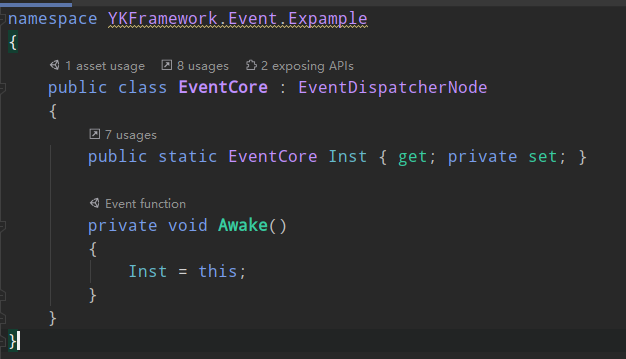
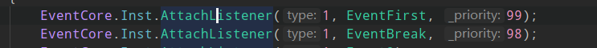
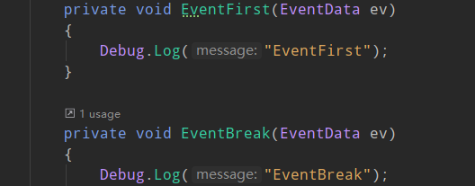
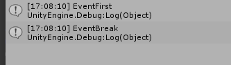
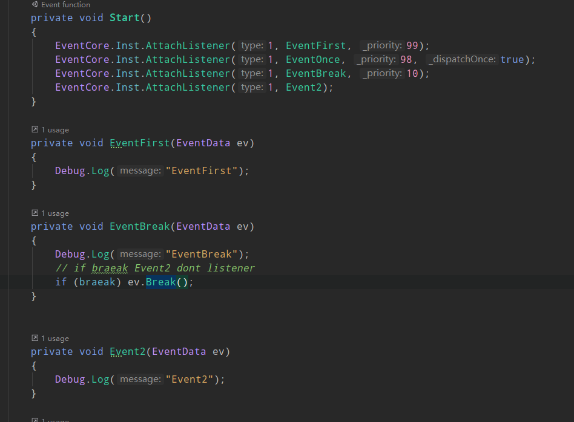
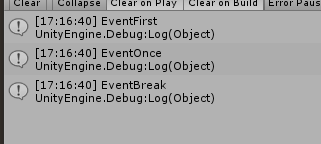
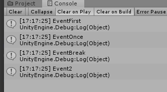
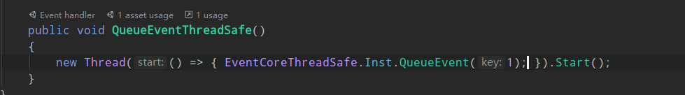
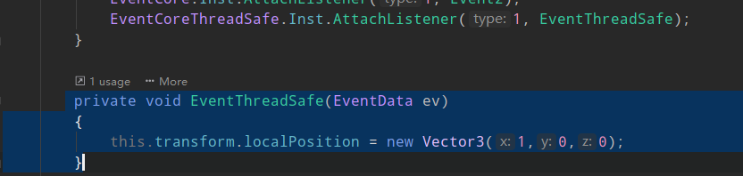
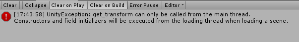

# Events

# 如何使用

## 创建消息节点  （EventNode）

只要你的类继承 `EventDispatcherNode` 就行
> ` 注意：` EventDispatcherNode  继承自MonoBehaviour 如有使用update函数改用onupdate

## 监听消息 
`EventCore.Inst.AttachListener(int type, EventListenerDele _listener, int _priority = 0, bool _dispatchOnce = false);` 

**参数说明** : 
type: 消息类型
_listener:回调函数
_priority :优先级（优先级越大越早收到）

例如 

console：

_dispatchOnce:只接受一次会自动移除监听

## 移除监听

DetachListener(type,listener)

## 消息中断

多个监听如果需要中断消息可以在消息监听的地方调用  EventData.Break()

例如:

console:

如果不中断：

## 线程安全消息

threadSafe 线程安全标示为true的时候有效，最好在初始化的时候设置

效果：
如果在另外一个线程发送消息不开启线程安全那么会出现

无法操作主线程

设置后不会报错并且操作都是正常的
